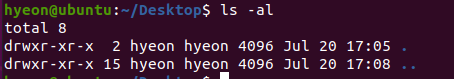
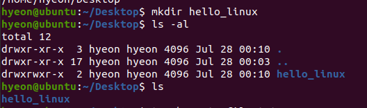
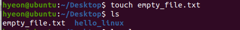
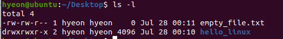

현재 내가 머물고 있는 디렉토리의 파일 목록을 확인할 수 있다.

아이콘을 클릭하는 방식을 통해 컴퓨터를 제어하는 것을 GUI라고 하고, 터미널 창에서 명령어로 컴퓨터를 제어하는 방식을 CLI(Command Line Inteface)이다. 내가 내리는 명령은 현재 내가 머물고 있는 디렉토리를 대상으로 해서 내려진다. 따라서 항상 내가 어느 위치의 디렉토리에 있는지 파악하는 것이 중요하다.

pwd를 입력하면 현재 내가 위치한 디렉토리를 확인할 수 있다. 

이번엔 새로운 directory를 만들어보자.

make directory를 줄여서 mkdir을 통해 새로운 디렉토리를 생성할 수 있다.
기본적으로 ls 명령어를 통해서 현재 내가 위치해 있는 디렉토리 내의 파일이나 디렉토리를 확인 해 볼 수 있다.

touch는 빈 파일을 생성할 때 사용하는 명령어인데, 중요한 명령어는 아니다. touch를 통해 빈 파일을 하나 생성하였고, 앞서 디렉토리와 마찬가지로 ls 명령어를 통해 확인할 수 있다.

요것은 파일의 리스트를 보여준다. 자세히 보여준다 는 뜻이다.

리눅스 명령어에서는 이렇게 ls 한칸 띄우고 - 뒤에 여러 글자를 적게 되는데 이때 - 뒤의 글자를 파라미터라고 부른다.

결과에서 맨앞에 d가 붙어있는데 이 때 d는 directory의 약어이다. d 가 붙어있으면 이것이 directory라는 의미이고 없으면 파일이다.